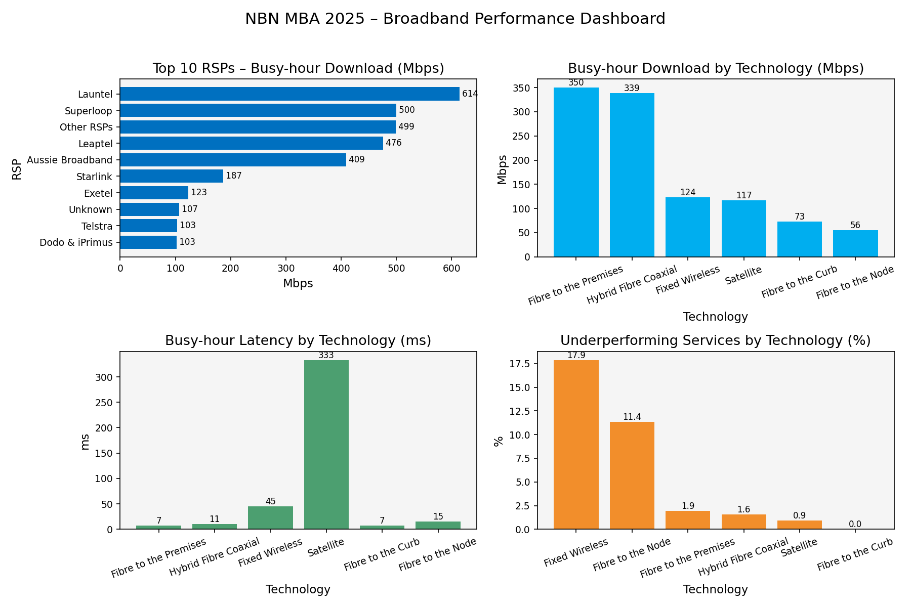

# 🛰️ NBN MBA Dataset Analysis

## 📘 Overview
This project analyses the **NBN MBA 2025 broadband performance dataset**, focusing on RSP (Retail Service Provider) performance across different access technologies such as **Fibre to the Premises (FTTP), Hybrid Fibre Coaxial (HFC), Fibre to the Node (FTTN), Fibre to the Curb (FTTC), Fixed Wireless, and Satellite**.

The objective is to uncover insights about:
- Average download speeds during busy hours  
- Latency distribution by technology  
- Percentage of underperforming services  
- Comparative trends among top RSPs and technologies  

Both **Python (Pandas, Matplotlib)** and **Power BI** were used to explore and visualize the dataset.

---

## 🧰 Tools and Technologies
- **Python:** Data cleaning and visualization using Pandas and Matplotlib  
- **Power BI:** Interactive dashboard creation  
- **CSV Datasets:** Provided MBA30 broadband performance data  
- **GitHub:** Version control and portfolio presentation  

---

## 🧮 Datasets Used
| File Name | Description |
|------------|-------------|
| `kpIs.csv` | Key performance indicators summary |
| `rsp_summary.csv` | RSP-level broadband performance metrics |
| `tech_summary.csv` | Technology-level performance summary |
| `network_health_by_tech.csv` | Network health and quality by technology |
| `summary_dashboard.png` | Python-generated static dashboard preview |
| `nbn_mba30_powerbi_dashboard.pbix` | Power BI interactive dashboard |
| `nbn_mba_analysis.ipynb` | Python notebook for analysis and chart generation |

---

## 📊 Dashboard Preview

The following visualization provides a high-level summary of broadband performance in the NBN MBA 2025 dataset, highlighting the top service providers and technology types across key KPIs such as busy-hour download speed, latency, and underperforming service ratios.

This dashboard was created using **Python (Pandas + Matplotlib)** for data processing and visualization.  
It offers clear comparisons across technologies like FTTP, HFC, Fixed Wireless, and Satellite, giving insight into which access types deliver the highest performance under load.

To explore or reproduce this visualization:
- View the interactive Power BI version: [`nbn_mba30_powerbi_dashboard.pbix`](nbn_mba30_powerbi_dashboard.pbix)
- Or run the full Python analysis notebook: [`nbn_mba_analysis.ipynb`](nbn_mba_analysis.ipynb)

Each file in this repository supports a different layer of the analysis pipeline:
- `kpIs.csv`, `rsp_summary.csv`, `tech_summary.csv` – core performance data tables  
- `network_health_by_tech.csv` – technology-specific KPI metrics  
- `summary_dashboard.png` – static Python-generated dashboard preview  
- `nbn_mba30_powerbi_dashboard.pbix` – dynamic Power BI visualization  

---

## 🔍 Key Insights
- **Fibre to the Premises (FTTP)** and **HFC** show the **highest busy-hour download speeds**, exceeding 300 Mbps on average.  
- **Satellite** exhibits the **highest latency (333 ms)**, while fixed-line services remain below 15 ms.  
- **Fixed Wireless** displays a **higher underperformance ratio (17.9%)**, indicating potential congestion during busy hours.  
- Overall, **fibre-based technologies consistently outperform wireless and satellite** in both speed and stability.  

---

## 📦 How to Use
1. Clone the repository:  
   git clone https://github.com/rennychan/nbn-mba30-dataset-analysis.git
   cd nbn-mba30-dataset-analysis

2. To view the Power BI dashboard, download and open: nbn_mba30_powerbi_dashboard.pbix

3. To run the Python analysis: jupyter notebook nbn_mba_analysis.ipynb
